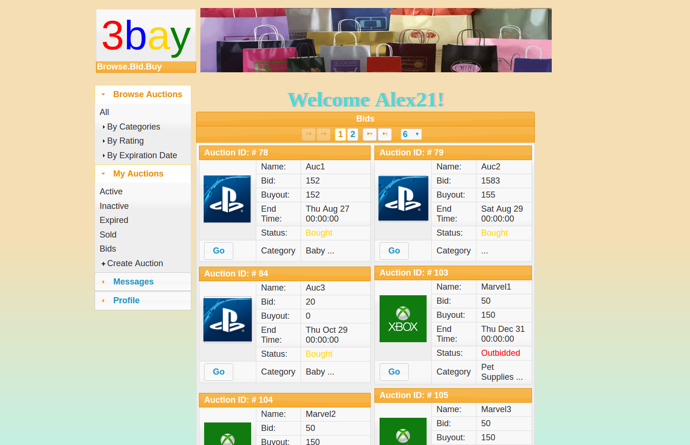

# 3bay
> Browse, Bid. Buy!

3bay is an awesome online auctioning web application showcasing many cool functionalities, developed as a semester team project by two Greek students. It provides an easy-to-use web interface along with a feature-rich backend that can be delpoyed rapidly!

[]()

## Table of Contents
- [Installation](#installation)
db nb server... first look (guest page)
- [Admin Guide](#admin-guide)
	- [User List](#user-list)
	- [Exporting](#exporting)
- [User Guide](#user-guide)
	- [Login - Register](#login-register)
	login register acceptance logout https
	- [Profile](#profile)
	map messages
	- [Messages](#messages)
	received write sent trash 
	- [Auctions](#auctions)
	browse filter view  rate
		- [Buy - Sell](#buy-sell)
		bids status create edit
- [Backstory](#backstory)
	- [Team Members](#team-members)

	
	
## Installation
- **Step 1:** *Download and Install an IDE*
Assume an Ubuntu 16.04 distro, the Development setup will be easier like this. We recommend NetBeans. (we are waiting for your forks and pull-requests!).

- **Step 2:** *Install the Java Web plugins*
...and all the dependencies (if not already included). In NetBeans this can be achieved through `Tools` > `Plugins` > `Available` > `Java EE Base`

- **Step 2:** *Setup a server*
A very easy to use web-server is the *Glashfish* project, and can be set up in a heartbeat followin [this guide](http://idroot.net/linux/install-glassfish-ubuntu-16-04/).

- **Step 3:** *Add server in IDE*
Make sure the IDE knows where to launch it from, any credentials needed and the can generally supported this server bundeled in. In NetBeans you can add Glashfish going to `Tools` > `Servers` > `Add Server` > `GlashFish Server` and fill in any specifics needed.

- **Step 4:** *Download 3bay*
You can `git clone` the repo, build and deploy the latest release's WAR archive or download the ZIP file and `Import` the Project to NetBeans. Suit yourself!

- **Step 5:** *Setup the Database*
Install MySQL, create the schema using the script provided, the user associated with the server and grant all privileges:

```bash
$ apt-get install mysql-server
$ mysql -u root -p
mysql> CREATE DATABASE mydb;
mysql> CREATE USER tsaou;
mysql> GRANT ALL ON mydb.* TO tsaou;
mysql> exit;
$ mysql mydb < mydb.sql
```

- **Step 6:** *Add JDBC connector in IDE*
Go to the `Project` panel > Select the `Services` tab > `Databases` > `Drivers` > `MySQL` and fill the info mentioned above.

- **Step 7:** *Upload the files*
Move the supplied [uploads](uploads/) directory to the server's web root (publicly accessible files). e.g. `<install_dir>/glashfish/domains/domain1/docroot` in GlashfFsh. This is necessary for the demo auctions' photos to appear.

- **Step 8:** *Launch 3bay!*
The final step is to `Run` the project from the IDE and tadaa! you are looking at a nice looking Log-in screen! Just visit [http://localhost:8080/3bay_4](http://localhost:8080/3bay_4) in case of the setup described in this guide.


## Team Members
[](https://github.com/LAripping)| []()
---|---
Leonidas Tsaousis | Alexandros Zeakis