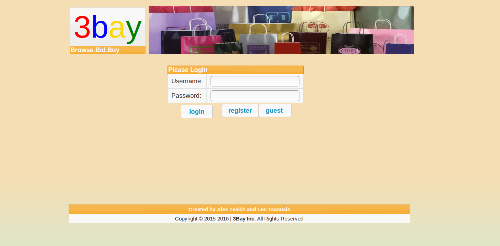

# 3bay
> Browse, Bid. Buy!

3bay is an awesome online auctioning web application showcasing many cool functionalities, developed as a semester team project by two Greek students. It provides an easy-to-use web interface along with a feature-rich backend that can be delpoyed rapidly!

[]()

## Table of Contents
- [Installation](#installation)
- [Admin Guide](#admin-guide)
	- User List
	- Exporting
- [User Guide](#user-guide)
	- Login - Register
	- Profile
	- Messages
	- Auctions
	- Buy - Sell
- [Team Members](#team-members)

	
	
## Installation
- **Step 1:** *Download and Install an IDE*
Assume an Ubuntu 16.04 distro, the Development setup will be easier like this. We recommend NetBeans. (we are waiting for your forks and pull-requests!).

- **Step 2:** *Install the Java Web plugins*
...and all the dependencies (if not already included). In NetBeans this can be achieved through `Tools` > `Plugins` > `Available` > `Java EE Base`

- **Step 2:** *Setup a server*
A very easy to use web-server is the *Glashfish* project, and can be set up in a heartbeat followin [this guide](http://idroot.net/linux/install-glassfish-ubuntu-16-04/).

- **Step 3:** *Add server in IDE*
Make sure the IDE knows where to launch it from, any credentials needed and the can generally supported this server bundeled in. In NetBeans you can add Glashfish going to `Tools` > `Servers` > `Add Server` > `GlashFish Server` and fill in any specifics needed.

- **Step 4:** *Download 3bay*
You can `git clone` the repo, build and deploy the latest release's WAR archive or download the ZIP file and `Import` the Project to NetBeans. Suit yourself!

- **Step 5:** *Setup the Database*
Install MySQL, create the schema using the script provided, the user associated with the server and grant all privileges:

```bash
$ apt-get install mysql-server
$ mysql -u root -p
mysql> CREATE DATABASE mydb;
mysql> CREATE USER tsaou;
mysql> GRANT ALL ON mydb.* TO tsaou;
mysql> exit;
$ mysql mydb < mydb.sql
```

- **Step 6:** *Add JDBC connector in IDE*
Go to the `Project` panel > Select the `Services` tab > `Databases` > `Drivers` > `MySQL` and fill the info mentioned above.

- **Step 7:** *Upload the files*
Move the supplied [uploads](uploads/) directory to the server's web root (publicly accessible files). e.g. `<install_dir>/glashfish/domains/domain1/docroot` in GlashfFsh. This is necessary for the demo auctions' photos to appear.

- **Step 8:** *Launch 3bay!*
The final step is to `Run` the project from the IDE and tadaa! you are looking at a nice looking Log-in screen! Just visit [http://localhost:8080/3bay_4](http://localhost:8080/3bay) in case of the setup described in this guide.

[]()

Now you can take a look around in guest mode, or log-in as the app administrator using the credentials found in the DB script.


## Admin Guide
Use the hard-coded username:password pair `Admin`:`admin`, to get access to the app's Administrative console where you can perform the following tasks:

  - *Approve User  Registrations* : Clicking the **Users** button in the sidebar the list of platform users is displayed where profile info for each one of them is available as well as an option to Accept/Reject pending registration forms submitted.
  - *Export Auctions to XML*: Viewing the Auctions enables the Admin to export them in an XML file for easy migration. Importing functionality is currently pending (Issue #4).

[]()


## User Guide
The application's users can login with their account credentials after creating one. Just fill the fields of the form that appears when clicking the **Register** button and wait for the admininstrator to review the request.

Alternatively, they can browse the auctions and look around without any personal information or the ability to Bid/Buy/Sell by clicking the **Guest** button in the login page.

The information mentioned above, consists of

- the user provided details passed in the registration
- a location visualisation
- the approval status
- the user's ratings both as a Seller and as Buyer

...and can be viewed in the **Profile** page accesible via the sidemenu's link in th bottom.

Also via the sidebar, the user can **Logout** from the app and return to the user home where a few **Suggestions** are featured for Auctions similar to the user's interests.

Last major feature to be described before the introduction to Auctions, is the Messaging framework implemented to contact other users (Sellers/Bidders/...), and includes *Received*, *Sent* and *Create* options listed under the **Messages** tab.

Received Messages | Received Messages (all)
---|---
[]()| []()
Create message | Sent Messages
[]()|[]()

Eventually, check out the gist of the application, the Auctions (sometimes noted as "Items" too), with the entry point of **All** listing, available in the Browse Auctions sidebar. 

* Filter by categories, ratings or expiration date to match your taste...
* Inspect [deeply](screenshots/pre-tag/item.png) the ones that "click" you...
* Closely [monitor](screenshots/pre-tag/my_auctions_expired_pasted.png) the ones you engaged with from the **My Auctions** tab...
* Don't think twice, go ahead and *Bid* for a chance to *Buy* it!
* Give a one-touch [rating](screenshots/pre-tag/item_bid_ratings.png) for others to know...
* Got to sell? [Create](screenshots/pre-tag/create_auction.png) your own item and list to get some easy cash!


### *...And that's only the beginning!*

A lot of features will be added, and for this we are waiting for your support, please fork us or file bugs and help make 3bay greater!


## Team Members
[](https://github.com/LAripping)| []()
---|---
Leonidas Tsaousis | Alexandros Zeakis